# Lodestone Programming Test

## Data Challenge

### Mark Oscar Mcadam
### mol3earth@gmail.com
### 417 576 8811
### July 14, 2020

---

## Introduction

The assignment was to generate a random table of Dates, Task IDs, Rater IDs, and Rater grades and Correct grades for the Task ID.
There are two grading scales for each Task, a 3 grade scale of 'low', 'average', and 'high', and a 5 grade scale of 'bad', 'okay', 'intermediate', 'great', and 'exceptional'.

Then I was to compare for each Task ID whether the Rater got the correct answer for each scale. 

After doing so I plotted the data and answered the questions below.

### Summary

As the inputs are all random the outputs will reflect this.  
For the 3 grade scale the average agreement was ~33%, which is what we would expect from a randomly generated answer. 3 options, 1/3 chance of choosing correctly.  
Likewise, for the 5 grade scale the average agreement is ~20%, again what we would expect as there are 5 options so 1/5 chance of choosing correctly.  

As the input is randomly generated the specific answers will are subject to changing upon rerunning the program. 

## Answers 

1. What is the agreement rate between the engineer and all the raters for each day?  
Ans:  This plot shows that the daily agreement has no trend. Why should it? The dates are arbitrary. 

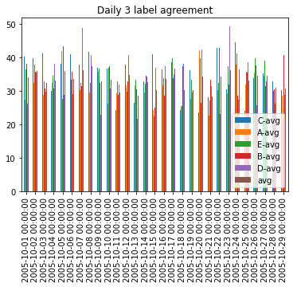  
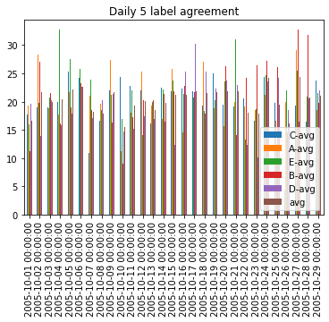  

2. What is the agreement rate between the engineer and all the raters for each week?  
Ans:  As with the daily agreement the weekly plots have no trend. 

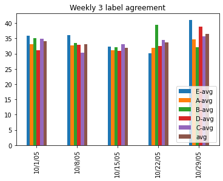  
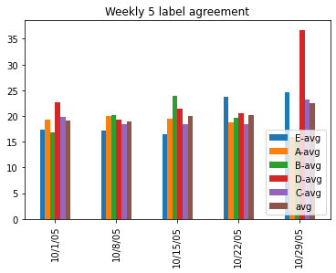  

3. Identify raters that have the highest agreement rates with the engineer.  
Ans. Rater **C** had the highest average agreement on the 3 grade scale. Rater **E** had the highest average agreement on the 5 grade scale.
4. Identify raters that have the lowest agreement rates with the engineer.  
Ans: Rater **A** had the lowest average agreement on the 3 grade scale. Rater **D** had the lowest average agreement on the 5 grade scale.
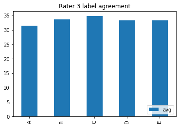  
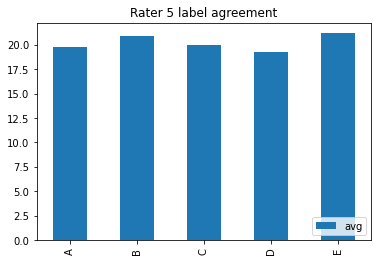  

5. Identify raters that have completed the most Task IDs.  
Ans: Rater **C** completed the most Task IDs.  
6. Identify raters that have completed the least Task IDs.  
Ans: Rater **B** completed the least Task IDs.  
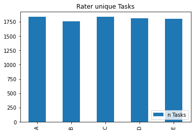  

7. What is the precision for each of the 5 labels?  
Ans:  The precision hovers around 20%.  
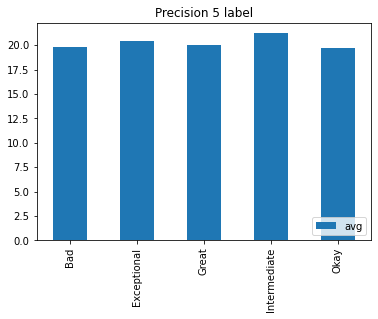  

8. What is the recall for each of the 5 labels?  
Ans:  The recall likewise hovers around 20%.  
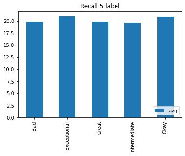  

9. What is the precision for each of the 3 labels?  
Ans:  The precision hovers around 33%.  
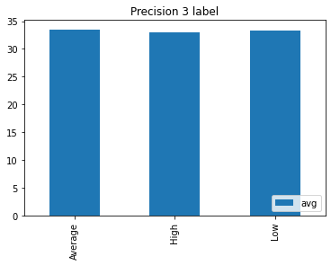  

10. What is the recall for each of the 3 labels?  
Ans:  The recall hovers around 33%.  
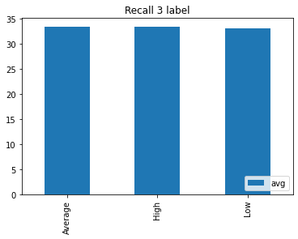  

11. What is the overall agreement rate considering that the raters have to be in agreement with both the engineer's 3-label answer and the engineer's 5-label answer.  
Ans:  6.72% which is nominally higher than the expected rate of 6.67% which comes from the combined probability of choosing both 1/3 and 1/5 correctly 1/3*1/5 = 1/15 = 6.6666.
